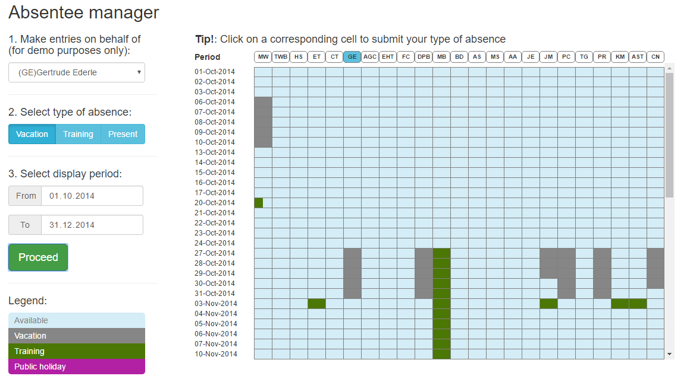

# Absentee manager

This project was generated with [angular-cli](https://github.com/angular/angular-cli) version 1.0.0-beta.21.

## Development server
Run `ng serve` for a dev server. Navigate to `http://localhost:4200/`. The app will automatically reload if you change any of the source files.
Run `ng build` to build the project. The build artifacts will be stored in the `dist/` directory. Use the `-prod` flag for a production build.

## Description
This is a demo app for managing absenteeism in teams of up to 40 people.

  

Sidebar menu actions:

1. For demo purposes you may choose any user from the list to make an entry on his/her behalf.
2. You may specify 'Vacation' or 'Training' as you type of absence or availability by pressing 'Present'.
3. Choose display period via 'start' and 'end' date inputs. Press 'Proceed' to display 'Absentee manager' table.
4. To choose another display period, select desired dates and press 'Proceed' once again.

Table actions:

1. You may click any cell under the column header with the nickname of chosen user. 
It will mark the corresponding date with a chosen type of absense. 
The background color of that cell will be changed according to the legend in the bottom of side bar. 
All the changes are saved to local objects automatically(along with the simulation of sending data to the server).
