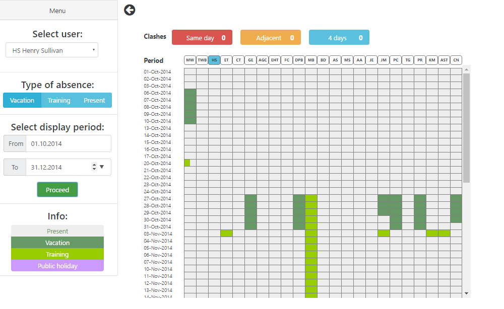

# Absentee manager

## Installation, Running and making a Build

This project was generated with [angular-cli](https://github.com/angular/angular-cli) version 1.0.0-beta.21.

* To install - clone the project and run `npm install`.
* To run the project - `ng serve` for a dev server. Navigate to `http://localhost:4200/`. The app will automatically reload if you change any of the source files.
* Use `ng build` to create a new build. The build artifacts will be stored in the `dist/` directory. Use the `-prod` flag for a production build.

## Description
This app can be used for managing absenteeism in teams of up to 40 people.

  

Sidebar menu actions:

1. For demo purposes you may choose any user from the list to make an entry on his/her behalf.
2. You may specify 'Vacation' or 'Training' as you type of absence or availability by pressing 'Present'.
3. Choose display period via 'start' and 'end' date inputs. Press 'Proceed' to display 'Absentee manager' table.
4. To choose another display period, select desired dates and press 'Proceed' once again.
5. Sidebar can be hidden/displayed by presing arrow right to the Menu header 

Table actions:

1. Each cell in the table represents 2 parts of a day split equally: 'AM' - on the left, 'PM' - on the right. Each of the parts can be selected separately.  

2. You may click any cell under the column header with the nickname of chosen user. 
It will mark the corresponding date with a chosen type of absense. 
The background color of that cell will be changed according to the legend in the bottom of side bar. 
All the changes are saved to local objects automatically(along with the simulation of sending data to the server).

3. User receives feedback on current clashes with other peers. 
    
        
    
    There are 3 types of clashes:
    
    * "Same day" clash - if any other team member reserved any part of the same day as 'Vacation' or 'Training'.
    * "Adjacent" clash - if any other team member reserved any part of the previous/next calendar day as 'Vacation' or 'Training'.
    * "4 days" clash - if any other team member reserved any part of the day as 'Vacation' or 'Training' which are in the range of +/- 4 calendar days.
